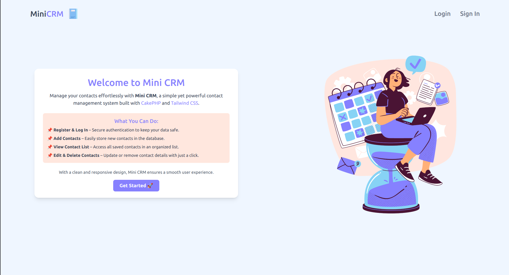
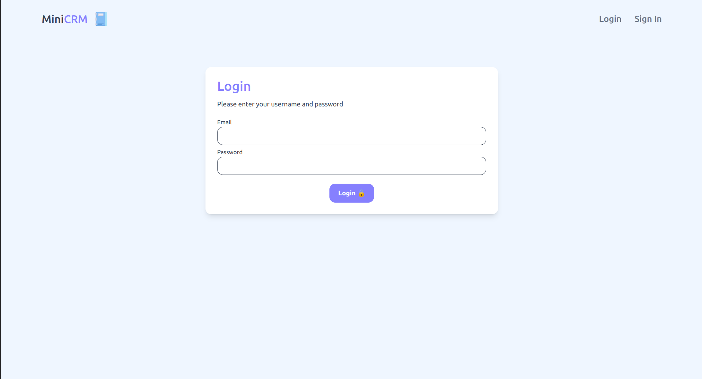
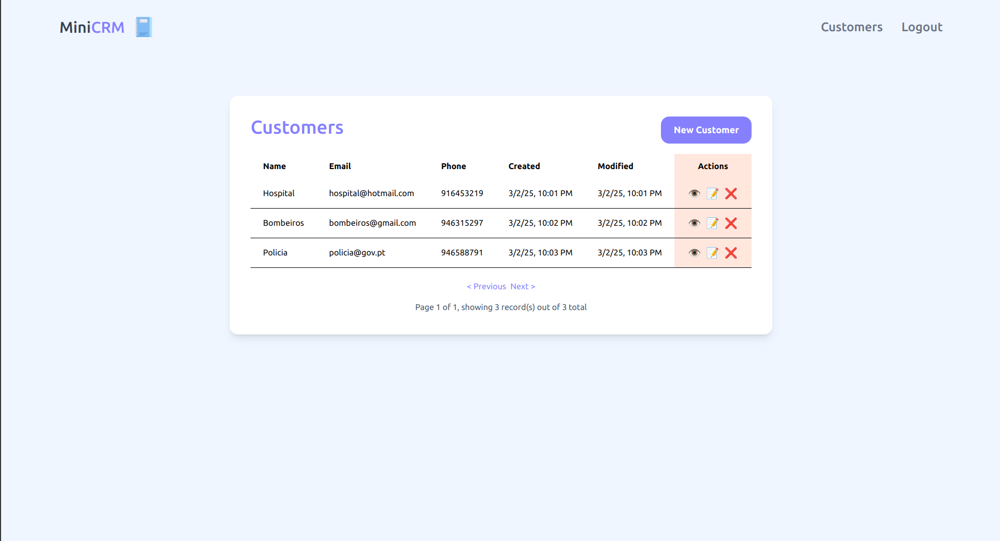
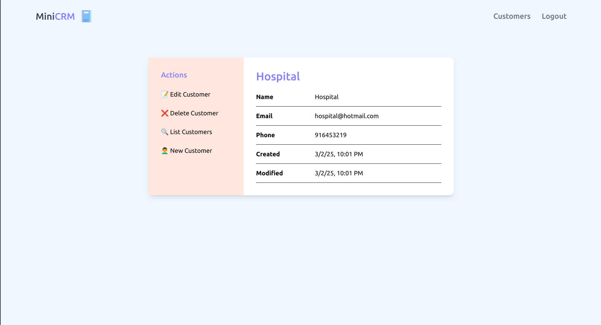
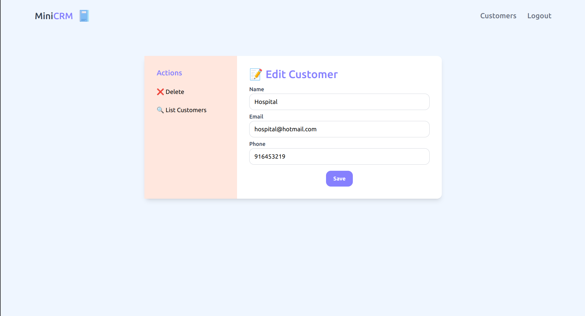
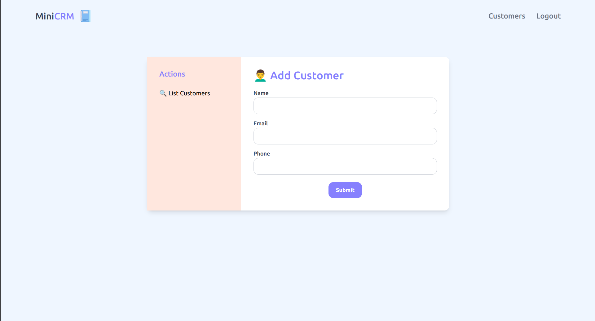

# 📌 Customer relationship management

This project is a **Customer relationship management** built using **CakePHP** and **TailwindCSS**, with **MySQL** as the database. The system allows users to register, log in, and manage their customers through an intuitive interface.

---

## 🚀 Features

 - **User Registration & Login**  
 - **Add New Customers**  
 - **List All Customers**  
 - **Edit & Delete Customers**  
 - **Secure Authentication System**  

---

## 🛠️ Technologies Used

- **CakePHP** (PHP Framework)  
- **TailwindCSS** (Styling)  
- **MySQL** (Database)  
- **GitHub** (Version Control)  

---

## 📂 Installation Guide

### 1) Clone the repository  
```sh
git clone https://github.com/tyhago14/MiniCRM.git
cd your-repo
```
### 2) Install dependencies
```sh
composer install
npm install
```
### 3) Configure database
 - **Create a MySQL database**
 - **Import the provided SQL file inside SQL_DUMP (cake_crm.sql)**
 - **Configure config/app.php with your database credentials**

---

### 4) Run the application
```sh
bin/cake server
```
Open http://localhost:8765 in your browser 🚀
## The password for users already in the database is **123**

## 📸 Screenshots

| Homepage | Login |
|----------|-------|
|  |  |

| Customers List | Customers View |
|--------------|-------------|
|  |  |

| Edit Customers | Add Customers |
|-------------|------------|
|  |  |


